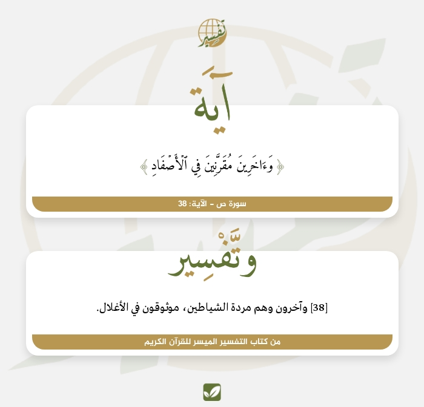

# بوت التقوى

<div align="center">
  

  <br>
  <br>

  بوت إسلامي لتطبيق تيليجرام يقدم العديد من الخدمات التي يحتاجها المسلم في يومه 

  <br>

  يقول النبي ﷺ: من دل على خير؛ فله مثل أجر فاعله 

  [مثال على بوت التقوى](https://t.me/adhk2r_bot)

</div>


# مميزات التطبيق

- نشر الرسائل بشكل تلقائي لجميع المشتركين في البوت سواء اشخاص او قنوات او قروبات
- القرآن الكريم | 158 قارئ
- حصن المسلم … أذكار الصباح والمساء والنوم الخ... | صوت و نص
- بطاقات القرآن الكريم | صوت و صورة
- صور عشوائية
- فيدوهات قرآن قصيرة
- اسماء الله الحسنى
- آية وتفسير | نص و صورة
- التاريخ الهجري | نص و صورة


# المتطلبات

- nodejs 
- متصفح chromium او chrom
- رمز token الخاص ببوت telegram | [BotFather](https://t.me/BotFather)
- تحرير ملف config.json 


```json
{
    "token_telegram": "5798247559:AAHdBHKKbA1l6mg2PA5EijTLcVNqEsBR-6U",
    "executablePath": "/snap/bin/chromium"
}
```

executablePath = مسار متصفح chromium او chrom


في الغالب هذه المسارات لجميع الانظمة

```
linux:

/usr/bin/google-chrome-stable

or 

/usr/bin/chromium

or 

/snap/bin/chromium


or

/usr/bin/chromium-browser

windows:


C:\\Program Files\\Google\\Chrome\\Application\\chrome.exe


MacOS:

/Applications/Google Chrome.app/Contents/MacOS/Google Chrome
```

# تثبيت 

```bash
git clone https://github.com/rn0x/altaqwaa_bot
cd altaqwaa_bot
npm i
npm start
```


# مثال على آية وتفسير و التاريخ الهجري

<div align="center">

  

  <br>
  <br>

  

  <br>
  <br>

  وفي الختام لاتنسنا من دعوة صالة بظهر الغيب .
</div>
